# PiDoors - Open Source Access Control System


**Professional-grade physical access control powered by Raspberry Pi**

---

## Overview

PiDoors is a complete, industrial-grade access control system built on Raspberry Pi hardware. It provides enterprise-level security features while remaining affordable and open source. Designed for small businesses, makerspaces, office buildings, or anyone needing professional access control.

**Key Benefits:**
- **Cost-Effective**: 10x cheaper than commercial systems (~$100-150 per door vs $500-2000)
- **Secure**: TLS database encryption, bcrypt passwords, SQL injection protection, CSRF tokens
- **Open Source**: Full control over your security system
- **Modern Interface**: React SPA with TailwindCSS — fast, responsive single-page application
- **Offline Capable**: 24-hour local caching keeps doors working during network outages
- **Extensible**: Easy to customize and integrate

---

## Screenshots

| Dashboard | Doors |
|-----------|-------|
| 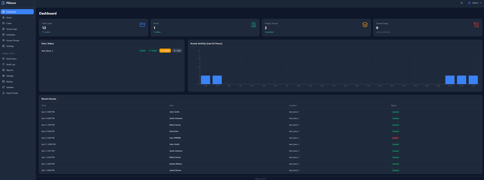 | 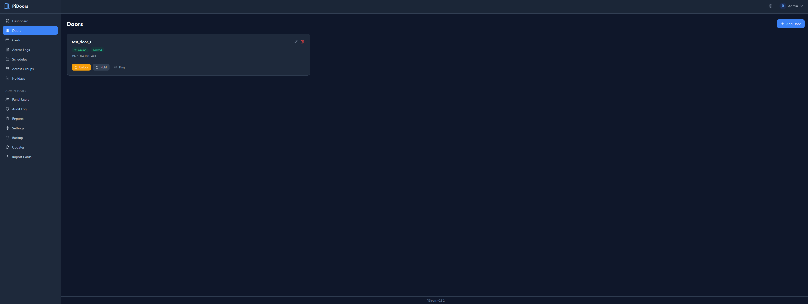 |

| Cards | Access Logs |
|-------|-------------|
| 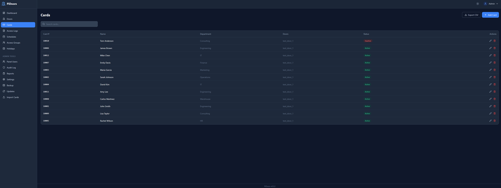 | 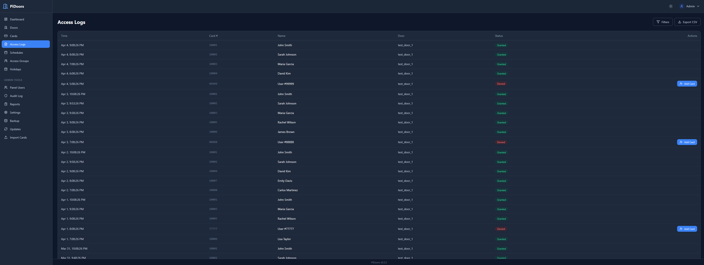 |

| Schedules | Access Groups |
|-----------|---------------|
| 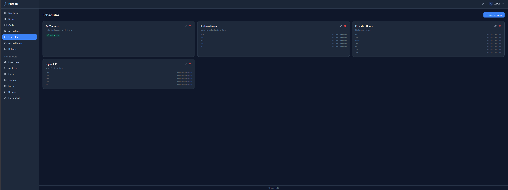 | 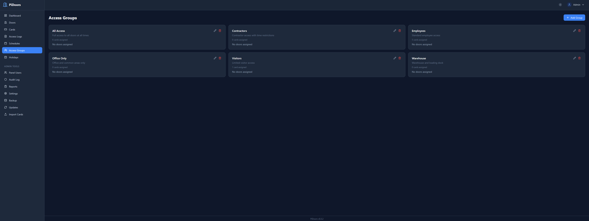 |

| Reports | Updates |
|---------|---------|
| 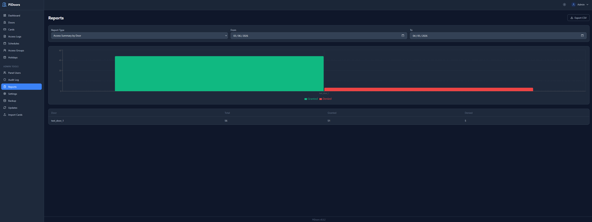 | 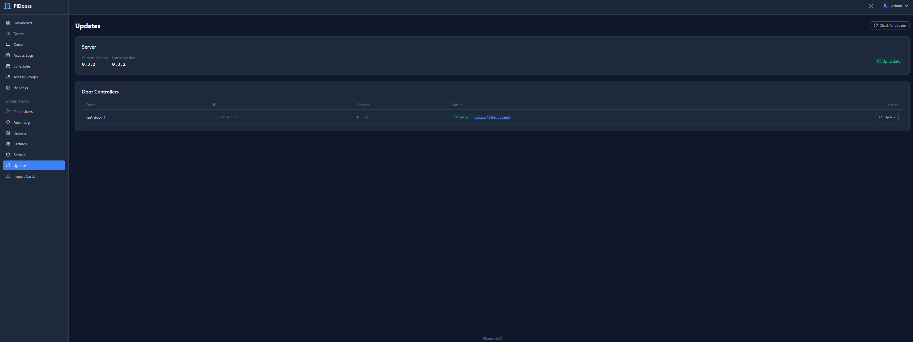 |

<details>
<summary>More screenshots</summary>

| Door Settings | Card Edit | Audit Log |
|---------------|-----------|-----------|
| 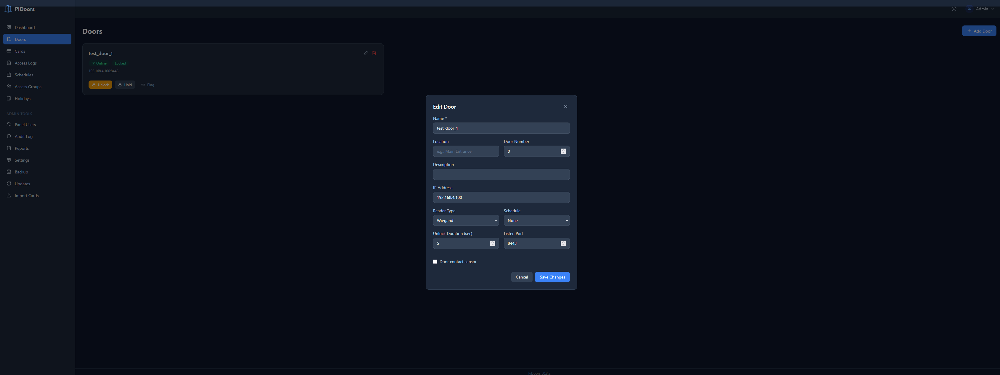 | 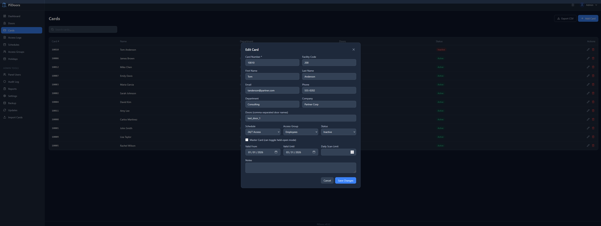 | 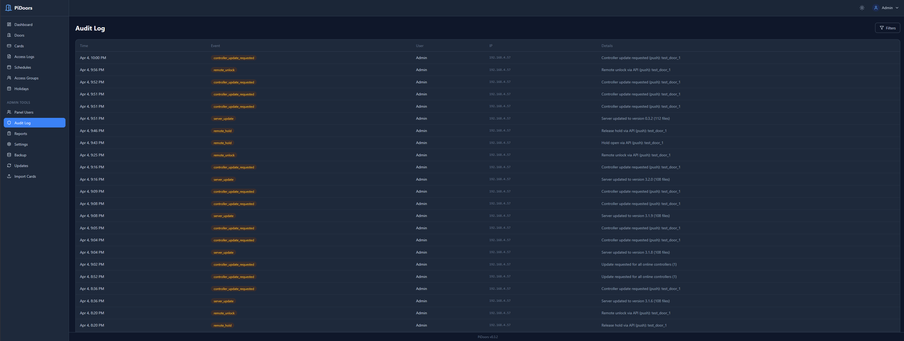 |

</details>

---

## Features

### Access Control
- **Multi-format Wiegand**: 26, 32, 34, 35, 36, 37, 48-bit with auto-detection
- **OSDP Readers**: RS-485 encrypted readers (planned — reader module included, not yet integrated)
- **NFC/RFID**: PN532 and MFRC522 support (planned — reader modules included, not yet integrated)
- Time-based access schedules
- Access groups and permissions
- Holiday calendar support
- Card validity date ranges
- Persistent master cards (never expire for emergency access)
- **Master card toggle** in web UI — promote any card to master with a checkbox

### Gate Mode
- Toggle any door into **gate mode** for rolling/sliding gates with motor controllers
- 3 configurable inputs (open / stop / close physical buttons)
- 3 configurable outputs (open / stop / close relays to gate motor)
- Per-output hold duration, configurable polarity, configurable GPIO pins
- Triple-tap any button to enter hold-current-state
- Master card 3-scan = hold open (configurable)
- Stop interrupts the active output immediately
- Reverse direction commands automatically stop and reverse
- Web UI shows live gate state (idle/opening/closing/stopped/open/closed) and dedicated control buttons
- State persists across controller restarts
- Server-side pin conflict checker prevents double-assigning GPIO pins

### Status LED
- Universal configurable LED that lights on access events and during hold states
- Per-door GPIO pin assignment, hi/lo polarity
- Works on both doors and gates

### Management
- Modern React SPA with REST API backend
- Login by username or email
- Real-time dashboard with analytics
- Multi-user administration with extended profiles (name, department, company, etc.)
- Extended cardholder details (email, phone, department, employee ID, company, title)
- CSV bulk import/export with all cardholder fields (including master card flag)
- Comprehensive reporting
- Email notifications
- Complete audit trail
- Remote door control
- Instant offline detection via server-initiated polling (no stale heartbeat data)
- Door auto-registration from client heartbeat

### Updates
- One-click server updates from the web UI
- Remote controller updates via heartbeat signaling
- Pre-flight checks prevent partial updates
- Actionable error messages on failure
- Version tracking across all doors and server

### Reliability
- 24-hour offline operation
- Automatic failover
- Health monitoring
- Auto-reconnection
- Automated backups
- Service redundancy

### Security
- **TLS database encryption** — controller-to-server connections encrypted automatically
- Bcrypt password hashing (cost 12)
- PDO prepared statements (SQL injection proof)
- CSRF protection on all forms
- Secure session management
- Input validation and sanitization
- Security event logging
- Rate limiting on login

---

## Quick Start

### Prerequisites

- Raspberry Pi 3B+ or newer (Pi 4 recommended for server)
- Raspberry Pi OS (Debian-based, 64-bit recommended)
- Internet connection for initial setup
- Node.js and npm (installed automatically by `install.sh`)
- For door controllers: card reader hardware and relay module

### Automated Installation (Recommended)

```bash
# Download PiDoors
git clone https://github.com/sybethiesant/pidoors.git
cd pidoors

# Run installer as root
sudo ./install.sh
```

The installer presents three installation modes:

| Mode | Use Case |
|------|----------|
| **1) Server** | Web interface + MariaDB database (run on your central Pi) |
| **2) Door Controller** | GPIO + card reader daemon (run on each door Pi) |
| **3) Full** | Both server and controller on one Pi (small deployments) |

#### What the installer does

1. Updates system packages
2. Installs dependencies (Nginx, PHP-FPM, MariaDB, Node.js, Python libraries)
3. Generates TLS certificates and enables encrypted database connections
4. Creates the `users` and `access` databases with all required tables
5. Imports the full database schema (base tables + migration extensions)
6. Deploys the PHP API to `/var/www/pidoors/`
7. Builds the React SPA and deploys to `/var/www/pidoors-ui/`
8. Configures Nginx to serve the SPA with `/api/*` routed to PHP-FPM
9. Prompts you to create an admin account (username, email + password)
10. Sets up log rotation and backup scripts

#### After installation

1. Open `https://your-pi-ip/` in a browser
2. Log in with the email (or username `Admin`) and password you set during install
3. Navigate to **Doors** to see your door controllers as they come online
4. Navigate to **Cards** to add access cards
5. Set up **Schedules** and **Access Groups** as needed

### Manual Installation

If you prefer to install manually or need to troubleshoot:

#### 1. Install system packages
```bash
sudo apt-get update && sudo apt-get install -y \
  nginx php-fpm php-mysql php-cli php-mbstring php-curl php-json \
  mariadb-server nodejs npm \
  python3 python3-pip python3-dev python3-venv git curl
```

#### 2. Create databases
```bash
sudo mysql_secure_installation

sudo mysql -u root -p <<'SQL'
CREATE DATABASE IF NOT EXISTS users;
CREATE DATABASE IF NOT EXISTS access;
CREATE USER IF NOT EXISTS 'pidoors'@'localhost' IDENTIFIED BY 'YOUR_PASSWORD';
CREATE USER IF NOT EXISTS 'pidoors'@'%' IDENTIFIED BY 'YOUR_PASSWORD';
GRANT ALL PRIVILEGES ON users.* TO 'pidoors'@'localhost';
GRANT ALL PRIVILEGES ON access.* TO 'pidoors'@'localhost';
GRANT ALL PRIVILEGES ON users.* TO 'pidoors'@'%';
GRANT ALL PRIVILEGES ON access.* TO 'pidoors'@'%';
FLUSH PRIVILEGES;
SQL
```

> **Note:** The `'pidoors'@'%'` user allows door controllers on other Pis to connect remotely. You also need to set `bind-address = 0.0.0.0` in `/etc/mysql/mariadb.conf.d/50-server.cnf` and restart MariaDB.

#### 3. Import schemas
```bash
# Create the users table and audit_logs table in the users database
sudo mysql -u root -p users <<'SQL'
CREATE TABLE IF NOT EXISTS `users` (
  `id` int(11) NOT NULL AUTO_INCREMENT,
  `user_name` varchar(100) NOT NULL,
  `user_email` varchar(255) NOT NULL,
  `user_pass` varchar(255) NOT NULL,
  `admin` tinyint(1) NOT NULL DEFAULT 0,
  `active` tinyint(1) NOT NULL DEFAULT 1,
  `created_at` datetime DEFAULT CURRENT_TIMESTAMP,
  `last_login` datetime DEFAULT NULL,
  PRIMARY KEY (`id`),
  UNIQUE KEY `user_email` (`user_email`)
) ENGINE=InnoDB DEFAULT CHARSET=utf8mb4;

CREATE TABLE IF NOT EXISTS `audit_logs` (
  `id` int(11) NOT NULL AUTO_INCREMENT,
  `event_type` varchar(50) NOT NULL,
  `user_id` int(11) DEFAULT NULL,
  `ip_address` varchar(45) DEFAULT NULL,
  `user_agent` varchar(255) DEFAULT NULL,
  `details` text,
  `created_at` datetime NOT NULL DEFAULT CURRENT_TIMESTAMP,
  PRIMARY KEY (`id`),
  KEY `event_type` (`event_type`),
  KEY `user_id` (`user_id`),
  KEY `created_at` (`created_at`)
) ENGINE=InnoDB DEFAULT CHARSET=utf8mb4;
SQL

# Import the access database schema and migration extensions
sudo mysql -u root -p access < database_migration.sql
```

The migration script creates all access tables, adds extended columns, and also switches to the `users` database to add profile columns. It is safe to re-run on existing installations.

#### 4. Create your admin user
```bash
# Generate a bcrypt hash for your password
HASH=$(php -r "echo password_hash('YOUR_PASSWORD', PASSWORD_BCRYPT);")

sudo mysql -u root -p users -e \
  "INSERT INTO users (user_name, user_email, user_pass, admin, active) \
   VALUES ('Admin', 'admin@example.com', '$HASH', 1, 1);"
```

#### 5. Deploy the PHP API
```bash
sudo mkdir -p /var/www/pidoors
sudo cp -r pidoorserv/* /var/www/pidoors/
sudo cp VERSION /var/www/pidoors/
sudo cp /var/www/pidoors/includes/config.php.example /var/www/pidoors/includes/config.php
sudo nano /var/www/pidoors/includes/config.php    # Set your database password and server IP
sudo chown -R www-data:www-data /var/www/pidoors
sudo chmod 640 /var/www/pidoors/includes/config.php
```

#### 6. Build and deploy the React SPA
```bash
sudo apt-get install -y nodejs npm
cd pidoors-ui
npm install && npm run build
sudo mkdir -p /var/www/pidoors-ui
sudo cp -r dist/* /var/www/pidoors-ui/
sudo chown -R www-data:www-data /var/www/pidoors-ui
cd ..
```

#### 7. Configure Nginx
```bash
# Detect your PHP version
PHP_VERSION=$(php -r "echo PHP_MAJOR_VERSION.'.'.PHP_MINOR_VERSION;")

# Install config with correct PHP socket path
sudo sed "s|php-fpm.sock|php${PHP_VERSION}-fpm.sock|g" \
  nginx/pidoors.conf > /etc/nginx/sites-available/pidoors
sudo ln -sf /etc/nginx/sites-available/pidoors /etc/nginx/sites-enabled/pidoors
sudo rm -f /etc/nginx/sites-enabled/default
sudo nginx -t && sudo systemctl reload nginx
```

See the [Installation Guide](pidoors/INSTALLATION_GUIDE.md) for additional details.

---

## System Architecture

```
                    REACT SPA (Browser)
     Dashboard | Cards | Doors | Logs | Reports | Settings
                          |
                     /api/* REST
                          |
     SERVER RASPBERRY PI
    +--------------------------+
    |  Nginx                   |
    |  ├─ /         → React   |
    |  └─ /api/*    → PHP-FPM |
    |  MariaDB (TLS)           |
    |  Backups & Logs          |
    +--------------------------+
          |                  |
     HTTPS Push         TLS/TCP DB
     (instant)          (sync/poll)
          |                  |
    +----------------+  +----------------+
    |  Door Pi #1    |  |  Door Pi #N    |
    |  Push Listener |  |  Push Listener |
    |  24hr Cache    |  |  24hr Cache    |
    |  Card Reader   |  |  Card Reader   |
    |  Electric Lock |  |  Electric Lock |
    +----------------+  +----------------+
```

**One server Pi** runs the React SPA, PHP API, and database.
**N door Pis** control individual access points with 24-hour local caching.
The server pushes commands instantly via HTTPS, with database polling as fallback.
The server pings controllers on each page load for instant status. Heartbeat runs every 5 minutes as a safety net.

---

## Hardware Requirements

### Server (1 per system)
| Component | Requirement |
|-----------|-------------|
| Board | Raspberry Pi 3B+ or newer (4GB RAM recommended) |
| Storage | 16GB+ microSD card |
| Network | Ethernet recommended |
| Power | Official Raspberry Pi power supply |

### Door Controller (1 per door)
| Component | Requirement |
|-----------|-------------|
| Board | Raspberry Pi Zero W or newer |
| Storage | 8GB+ microSD card |
| Reader | See supported readers below |
| Lock | 12V electric strike or magnetic lock |
| Relay | Relay module for lock control |
| Optional | Door sensor, REX button |

**Supported Card Readers:**
| Type | Interface | Notes |
|------|-----------|-------|
| Wiegand (26/32/34/35/36/37/48-bit) | GPIO | Most common, auto-detection |
| OSDP v2 | RS-485 (UART) | Encrypted, requires USB-RS485 adapter |
| PN532 NFC | I2C or SPI | Mifare Classic, Ultralight, NTAG |
| MFRC522 NFC | SPI | Low-cost Mifare reader |

**Total cost per door: ~$100-150**

---

## Configuration

### Server Configuration

1. Copy the configuration template:
```bash
cp pidoorserv/includes/config.php.example pidoorserv/includes/config.php
```

2. Edit configuration:
```bash
nano pidoorserv/includes/config.php
```

3. Set your values:
```php
return [
    'sqladdr' => '127.0.0.1',
    'sqldb' => 'users',
    'sqldb2' => 'access',
    'sqluser' => 'pidoors',
    'sqlpass' => 'your_secure_password',
    'url' => 'https://your-pi-ip',
    // ... other settings
];
```

4. Secure the file:
```bash
chmod 640 pidoorserv/includes/config.php
```

### Door Controller Configuration

1. Copy the configuration template:
```bash
cp pidoors/conf/config.json.example pidoors/conf/config.json
```

2. Edit configuration:
```bash
nano pidoors/conf/config.json
```

3. Set your values (use your actual door name as the key):
```json
{
    "frontdoor": {
        "reader_type": "wiegand",
        "d0": 24,
        "d1": 23,
        "wiegand_format": "auto",
        "latch_gpio": 18,
        "open_delay": 5,
        "unlock_value": 1,
        "sqladdr": "SERVER_IP_ADDRESS",
        "sqluser": "pidoors",
        "sqlpass": "your_database_password",
        "sqldb": "access"
    }
}
```

---

## Wiring Guide

### Wiegand Reader to Raspberry Pi

**Important:** Most Wiegand readers output 5V logic signals, but Raspberry Pi GPIO pins are 3.3V only. A **bi-directional logic level shifter** (5V to 3.3V) is recommended on the DATA0 and DATA1 lines to protect the Pi's GPIO pins. Without one, the Pi may work initially but the GPIO pins can be damaged over time.

| Wiegand Reader | Level Shifter | Raspberry Pi |
|----------------|---------------|--------------|
| DATA0 (Green)  | HV1 → LV1    | GPIO 24      |
| DATA1 (White)  | HV2 → LV2    | GPIO 23      |
| GND (Black)    | GND (shared)  | GND (Pin 6)  |
| 5V+ (Red)      | HV            | 5V (Pin 2)   |
| —              | LV            | 3V3 (Pin 1)  |

### Lock Relay Control

| Relay Module | Raspberry Pi |
|--------------|--------------|
| IN           | GPIO 18      |
| VCC          | 5V (Pin 4)   |
| GND          | GND (Pin 14) |

Connect lock to relay NO/COM terminals with 12V power supply.

### Gate Mode Wiring (Optional)

For rolling/sliding gates with motor controllers, enable **Gate Mode** in the door edit page. Each gate has up to 3 inputs (physical buttons) and 3 outputs (relays to the gate motor). All inputs and outputs are optional — only enable the ones your hardware supports. GPIO pins are assigned in the web UI from the available pin list.

**Gate Outputs (relays to motor)** — typically wire each relay's NO/COM terminals to the corresponding input on your gate motor controller (open, stop, close terminals).

| Gate Output | Purpose |
|-------------|---------|
| Open relay  | Held active for the configured duration to open the gate |
| Close relay | Held active for the configured duration to close the gate |
| Stop relay  | Optional — fires when stop is triggered, for motor controllers with a dedicated stop input |

**Gate Inputs (physical buttons or RF remote relays)** — wire the button/relay between the assigned GPIO pin and GND (default pull-up mode).

| Gate Input  | Purpose |
|-------------|---------|
| Open button | Triggers the open output (3-tap = hold open) |
| Close button | Triggers the close output (3-tap = hold closed) |
| Stop button | Cuts the active output immediately (3-tap = hold at current position) |

**Voltage Warning:** Same as Wiegand readers — if your buttons or RF remote relays output 5V signals, use a level shifter to protect the Pi's 3.3V GPIO inputs. For dry-contact switches (relay closures to ground) no level shifter is needed.

In gate mode, the regular **Lock Relay** is unused — the gate's open/close outputs replace it. The "Unlock Duration" field in the door edit page is automatically hidden when gate mode is enabled. Each gate output has its own configurable hold duration.

### GPIO Pin Reference
```
    3V3  (1)  (2)  5V
  GPIO2  (3)  (4)  5V
  GPIO3  (5)  (6)  GND
  GPIO4  (7)  (8)  GPIO14
    GND  (9)  (10) GPIO15
 GPIO17 (11) (12) GPIO18    <- Relay (GPIO18)
 GPIO27 (13) (14) GND
 GPIO22 (15) (16) GPIO23    <- DATA1 (GPIO23)
    3V3 (17) (18) GPIO24    <- DATA0 (GPIO24)
```

Full wiring diagrams available in [Installation Guide](pidoors/INSTALLATION_GUIDE.md#wiring).

---

## Usage

### Adding a Card

**Via Web Interface:**
1. Navigate to **Cards** > **Add Card**
2. Enter card details (scan card at reader to get ID)
3. Assign access groups and schedules
4. Click **Add Card**

**Via CSV Import:**
```csv
card_id,user_id,firstname,lastname,email,department
12345678,EMP001,John,Smith,john@example.com,Engineering
87654321,EMP002,Jane,Doe,jane@example.com,Marketing
```

Upload at **Cards** > **Import CSV**. Optional columns: `email`, `phone`, `department`, `employee_id`, `company`, `title`, `notes`, `group_id`, `schedule_id`, `valid_from`, `valid_until`, `pin_code`.

### Creating Access Schedules

1. Go to **Schedules** > **Add Schedule**
2. Name the schedule (e.g., "Business Hours")
3. Set time windows for each day
4. Assign to cards or doors

### Monitoring Access

- **Dashboard**: Real-time statistics and charts
- **Access Logs**: Filter by date, door, user; export to CSV
- **Audit Log**: Track all administrative actions
- **Email Alerts**: Failed access attempts, door offline notifications

---

## Maintenance

### Automatic Backups
Backups run daily at 2 AM to `/var/backups/pidoors/`

### Manual Backup
```bash
sudo /usr/local/bin/pidoors-backup.sh
```

### Update PiDoors

**Via Web UI (Recommended):**
1. Go to **Updates** in the admin sidebar
2. Click **Check for Updates** to see the latest release
3. Click **Update Server** to update the web interface
4. Use the **Doors** page to push updates to door controllers

**Manual update:**
```bash
cd ~/pidoors
git pull
sudo cp -r pidoorserv/* /var/www/pidoors/
sudo systemctl restart nginx
sudo systemctl restart pidoors  # On door controllers
```

### Database Migrations

When upgrading, run the migration script to add any new columns:

```bash
# Backup first
mysqldump -u pidoors -p access > backup_access_$(date +%Y%m%d).sql
mysqldump -u pidoors -p users > backup_users_$(date +%Y%m%d).sql

# Run migration (safe to re-run, uses IF NOT EXISTS checks)
mysql -u root -p access < database_migration.sql
```

The migration script handles both the `access` and `users` databases automatically.

**v2.2.1 Migration (Required if upgrading from v2.2 or earlier):**

This migration converts door assignments from space-separated to comma-separated format:

```bash
python3 migrations/migrate_doors_format.py --dry-run   # Preview
python3 migrations/migrate_doors_format.py              # Apply
```

### View Logs
```bash
# Door controller logs
sudo journalctl -u pidoors -f

# Web server logs
sudo tail -f /var/log/nginx/pidoors_error.log
```

---

## Security

### Security Features
- TLS encryption for all database connections (auto-configured during install)
- Bcrypt password hashing with automatic MD5 upgrade
- PDO prepared statements (no SQL injection)
- CSRF token protection on all forms
- Secure session handling with timeout
- Comprehensive input validation
- Complete audit logging
- Login rate limiting (5 attempts, 15-minute lockout)

### Reporting Vulnerabilities
Please report security issues to the repository owner directly, not via public issues.

---

## File Structure

```
pidoors/
├── pidoorserv/           # PHP API backend
│   ├── api.php           # Unified REST API router
│   ├── includes/         # Core PHP includes
│   │   ├── config.php.example
│   │   ├── security.php
│   │   ├── header.php
│   │   ├── push.php      # Push communication & status polling
│   │   ├── notifications.php
│   │   └── smtp.php      # Lightweight SMTP sender
│   ├── cron/             # Scheduled tasks (notifications)
│   ├── users/            # User management
│   ├── database/         # Database connection
│   ├── css/              # Stylesheets (legacy)
│   └── js/               # JavaScript (legacy)
├── pidoors-ui/           # React SPA frontend
│   ├── src/
│   │   ├── pages/        # Dashboard, Cards, Doors, Settings, etc.
│   │   ├── components/   # Shared UI components
│   │   ├── contexts/     # Auth context
│   │   ├── api/          # REST API client
│   │   └── types/        # TypeScript type definitions
│   ├── package.json
│   └── vite.config.ts
├── pidoors/              # Door controller
│   ├── pidoors.py        # Main daemon
│   ├── pidoors.service   # Systemd service
│   ├── pidoors-update.sh # Self-update script (runs as root via sudo)
│   ├── readers/          # Card reader modules
│   │   ├── base.py       # Abstract base class
│   │   ├── wiegand.py    # Wiegand GPIO reader
│   │   ├── osdp.py       # OSDP RS-485 reader
│   │   ├── nfc_pn532.py  # PN532 NFC reader
│   │   └── nfc_mfrc522.py # MFRC522 NFC reader
│   ├── formats/          # Card format definitions
│   │   └── wiegand_formats.py
│   └── conf/             # Configuration
│       └── config.json.example
├── nginx/                # Nginx configuration
│   └── pidoors.conf
├── docker/               # Docker dev/test environment
│   ├── docker-compose.yml
│   ├── Dockerfile.server
│   ├── Dockerfile.door
│   ├── server-entrypoint.sh
│   ├── door-entrypoint.sh
│   ├── deploy.sh         # Deploy to remote Docker host
│   └── mock_gpio.py      # Mock GPIO for containerized door
├── VERSION               # Current version number
├── install.sh            # Installation script
├── server-update.sh      # Server self-update script
├── database_migration.sql
└── README.md
```

---

## Documentation

| Document | Description |
|----------|-------------|
| [Installation Guide](pidoors/INSTALLATION_GUIDE.md) | Complete beginner-friendly setup |

---

## Contributing

Contributions welcome! Please:

1. Fork the repository
2. Create a feature branch (`git checkout -b feature/amazing-feature`)
3. Commit your changes (`git commit -m 'Add amazing feature'`)
4. Push to the branch (`git push origin feature/amazing-feature`)
5. Open a Pull Request

**Requirements:**
- Test on actual Raspberry Pi hardware
- Verify database migrations work
- Check security implications
- Update documentation

---

## Roadmap

**Current Version: 0.3.6** - Pre-release

**Future Enhancements** (community contributions welcome):
- Mobile app (iOS/Android)
- Bluetooth Low Energy (BLE) readers
- Biometric integration (fingerprint, face)
- Cloud backup integration
- Multi-site management dashboard

---

## Changelog

> **Note:** Version numbering was reset from 3.x to 0.x in April 2026. The project had rapidly iterated from v1.0 to v3.2 during initial development. The 0.x series reflects pre-release status as the system matures toward a proper v1.0.0 release.

### Version 0.3.6 (April 2026)
- **Fix**: `index.html` no longer cached by browsers — nginx now sends `Cache-Control: no-cache` for the SPA entry point so users don't see stale UI after an update. Hashed JS/CSS assets still cache for a year.
- **Fix**: Web UI server updates now also upgrade the nginx config if it's changed (via a new root-owned helper script + sudoers entry for www-data). This deploys nginx changes like the cache-control fix without requiring shell access.
- **Fix**: Python `SyntaxError` in the controller's rename handler (nested `global zone` declaration) that bricked the service after updating to 0.3.5.

### Version 0.3.5 (April 2026)
- **Fix**: Door rename could corrupt `config.json` when the controller's in-memory `zone` variable fell out of sync with the on-disk config after a failed restart
- **Fix**: Rename handler updates the in-memory `zone` immediately so subsequent pushes work even if the service restart fails
- **Fix**: Sudoers now allows `systemctl restart pidoors` so rename can actually restart the service
- **Fix**: Rename refuses to proceed if the old zone key is missing from config.json (prevents creating empty broken entries)
- **Fix**: Same-name renames are a no-op
- **Fix**: Update script guards against double self-update in the same chain
- **Fix**: Update script reads zone from `zone.json` (source of truth) and refuses to create a phantom empty zone entry if the zone is missing

### Version 0.3.4 (April 2026)
- Pin selector dropdowns show all GPIO pins but disable ones already in use — both within the form (other gate I/O, status LED, sensor) and by reserved hardware features (reader, lock relay)
- Disabled options labeled clearly as `GPIO X (in use)` or `GPIO X (Wiegand DATA0)`
- Hide `Unlock Duration` field when gate mode is enabled
- Documentation: gate mode and status LED sections added to README and INSTALLATION_GUIDE

### Version 0.3.3 (April 2026)
- **Gate mode** — toggle on the door edit page to convert a door into a gate with open/close/stop inputs and outputs
- **Configurable gate I/O** — each input/output is optional with assignable GPIO pin, hi/lo polarity, and (for outputs) hold duration
- **Triple-tap hold** — physical open/close/stop buttons enter hold-current-state when triple-tapped within the configured window
- **Gate state reporting** — controller reports current gate state (idle/opening/closing/stopped/open/closed/held) to the web UI
- **Gate web UI** — dedicated open/close/stop/hold/release buttons on the doors page when in gate mode, with status badge
- **Status LED feature** — universal configurable LED that lights up on access events and during hold states (works on doors and gates)
- **Pin conflict checker** — server-side endpoint validates GPIO pin assignments don't conflict with reader, sensor, or other features
- **Master scan settings** — configurable master scans to hold open / release hold (defaults: 3 / 1)
- **Push timeout fix** — increased default push timeout from 3s to 5s to accommodate Pi Zero TLS handshake delays
- **Door rename push** — when renaming a door, server pushes the new name to the controller, which updates its config and restarts

### Version 0.3.2 (April 2026)
- **Door rename protection** — doors must be online to rename; server pushes the name change to the controller, which updates its config and restarts
- **Reliable controller self-updates** — update script detaches from the service cgroup before stopping the service; temp files use `/var/cache/` to survive PrivateTmp
- **Self-update compatibility** — patches older release scripts during self-update with cgroup detach, venv python, and temp dir fixes for seamless upgrades from any prior version
- **Version transition** — update system handles the 3.x → 0.x renumbering so existing installations update seamlessly
- **Heartbeat fix** — `door_sensor_open` missing global declaration broke heartbeat entirely; doors never auto-registered or showed online
- **MariaDB TLS** — fixed three issues preventing TLS on fresh installs: grep matched commented-out defaults, wrong config section header on newer MariaDB, server cert missing SAN IP
- **CA cert signing** — fixed serial file permissions and empty tempfile issues that broke the signing API
- **Update script** — uses venv Python for pymysql, adds curl timeouts, re-signs listener cert on every update
- **Installer improvements** — socket auth detection, SSL permissions always applied, menu formatting fixed
- **Pre-built React SPA** included in release tarballs (no Node.js needed for server updates)

### Earlier History (January — March 2026)
- **v3.0**: React SPA frontend rewrite, REST API, push-based instant controller communication via HTTPS
- **v2.6**: TLS database encryption, email notifications, self-healing TLS connections
- **v2.5**: Version tracking, server and controller self-update system, remote door unlock
- **v2.4**: Master card web UI, GPIO fix for Debian Bookworm (rpi-lgpio), automated installer
- **v2.3**: Login by username, extended user/cardholder profiles, CSV import
- **v2.2**: Multi-reader support (Wiegand/OSDP/NFC), security hardening, Bootstrap modals
- **v2.0**: Security overhaul, 24-hour offline caching, time-based schedules
- **v1.0**: Initial release — basic Wiegand 26-bit support, simple web interface
- Email notifications
- Automated backups
- Multi-format Wiegand support

### Version 1.0 (Original)
- Basic Wiegand 26-bit support
- Simple web interface
- MySQL database

---

## License

This project is open source and available for free use, modification, and distribution.

---

## Support

- **Documentation**: [Installation Guide](pidoors/INSTALLATION_GUIDE.md)
- **Bug Reports**: [GitHub Issues](https://github.com/sybethiesant/pidoors/issues)
- **Feature Requests**: [GitHub Issues](https://github.com/sybethiesant/pidoors/issues)

---

**Built for the open source community**
